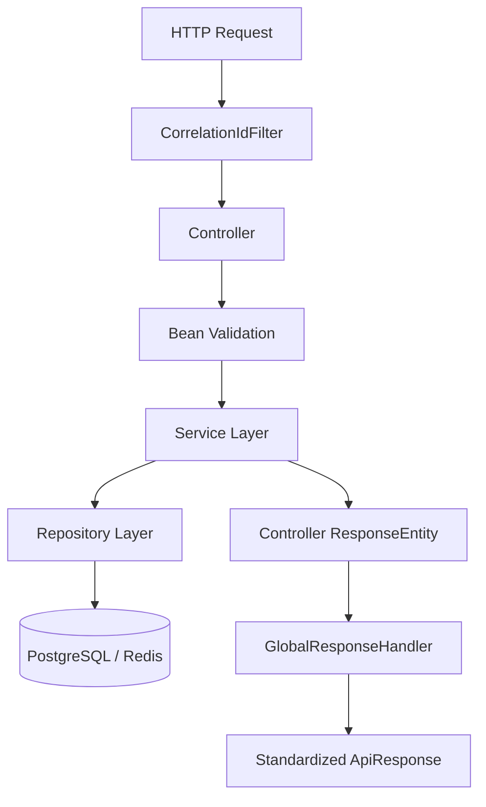
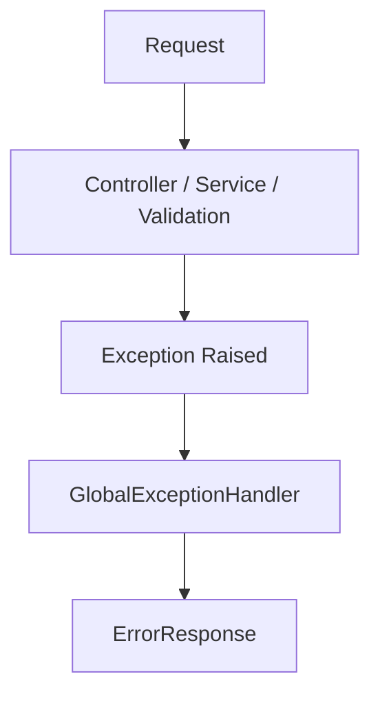
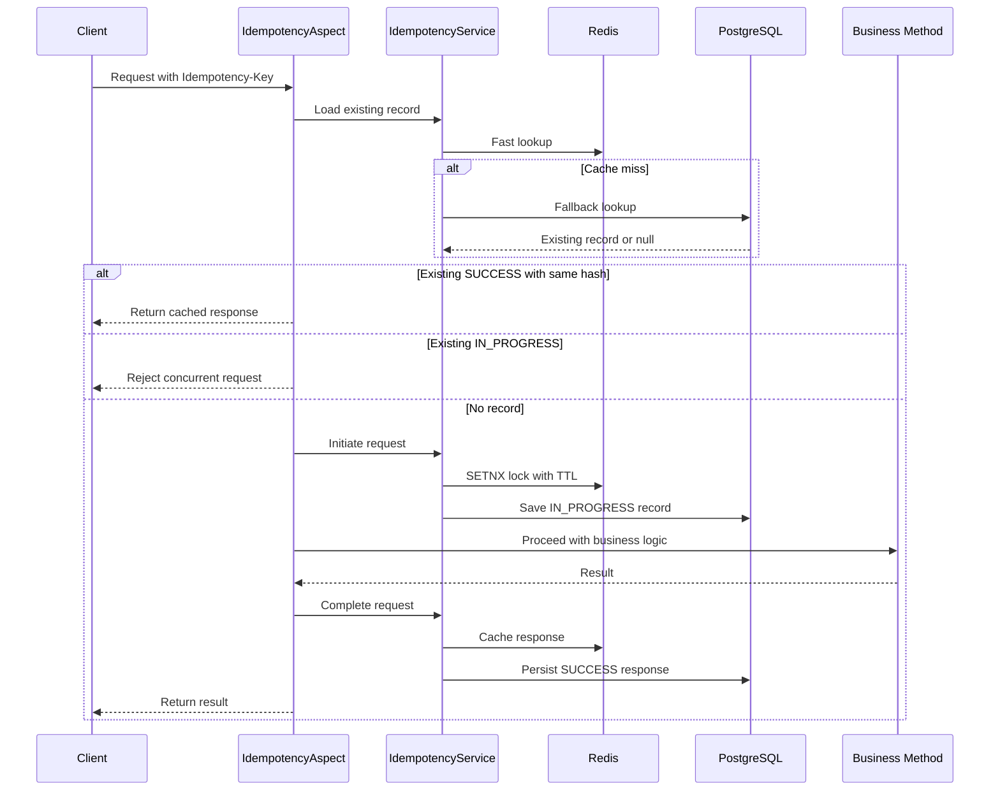

# Cognitive Twin Backend

Current-state architecture documentation for the `Cognitive-Twin` backend.

This project is evolving as a modular backend focused on production-style backend patterns: layered design, DTO mapping, validation, standardized responses, structured logging, and a distributed idempotency foundation. The codebase is already shaped like a scalable backend, but some parts are still scaffolding or partially integrated.

## 1. Executive Summary

At the moment, this repository is best described as a **modular monolith built with Spring Boot and Java 21**. Its strongest implemented areas are:

- User registration and retrieval
- Order creation and querying
- Payment domain modeling and service logic
- Cross-cutting API response wrapping and exception handling
- Correlation-ID based request tracing
- A Redis + PostgreSQL backed idempotency subsystem foundation

Just as important, there are also some clear current-state gaps:

- The code currently uses **Spring Boot `3.5.13`**, not Spring Boot 4
- The idempotency infrastructure is implemented, but **no controller endpoint currently uses `@Idempotent`**
- Payment logic exists in the service and persistence layers, but **no payment controller is currently exposed**
- Docker assets are **not present in this repository right now**
- There are **no test classes under `src/test`**
- `application.yaml` currently contains direct infrastructure credentials instead of environment-based configuration

## 2. Current Runtime Stack

### Language and Framework

- Java 21
- Spring Boot 3.5.13
- Spring Web
- Spring Data JPA
- Spring Validation
- Spring Security
- Spring Data Redis
- Spring AOP
- Spring Data Neo4j dependency included
- Spring Actuator dependency included

### Persistence and Infrastructure

- PostgreSQL as the primary relational database
- Redis for fast key lookup and distributed request coordination
- Neo4j is configured as a dependency and connection target, but graph features are not implemented in the current Java source files

### Supporting Libraries

- MapStruct for DTO mapping
- Lombok for boilerplate reduction
- Guava for SHA-256 request hashing
- Springdoc OpenAPI UI for API documentation generation

## 3. Architecture Style

The backend follows a **layered architecture inside a modular package layout**.

Primary flow:

```text
HTTP Request
  -> Filter layer
  -> Controller
  -> Service
  -> Repository
  -> Database / Redis
  -> Response wrapper
```

The code is not split into microservices. Instead, it uses a single deployable Spring application with domain-focused packages such as `user`, `order`, `payment`, and common infrastructure packages for cross-cutting concerns.

This is a good fit for the current project stage because it keeps operational complexity low while still allowing clean module boundaries.

## 4. Current Module Layout

The actual source tree currently looks like this:

```text
src/main/java/com/example/cognitivetwin
├── common
│   ├── annotations
│   ├── aspects
│   ├── idempotency
│   └── util
├── config
├── exception
│   ├── custom
│   ├── handler
│   └── response
├── infrastructure
│   └── redis
├── mapper
├── order
│   ├── controller
│   ├── dto
│   ├── entity
│   ├── repository
│   └── service
├── payment
│   ├── dto
│   ├── entity
│   ├── repository
│   └── service
├── security
│   └── config
├── specifications
└── user
    ├── controller
    ├── dto
    ├── entity
    ├── repository
    └── service
```

There are also several empty or non-implemented package paths already created in the tree, such as AI, graph, customer, interaction, ticket, event, and orchestrator related packages. These indicate future direction, but they are not active parts of the current running implementation.

## 5. Core Architectural Building Blocks

### 5.1 Entry Point

`CognitiveTwinApplication` is the Spring Boot bootstrap class and enables JPA auditing through `@EnableJpaAuditing`.

That auditing support is used by `BaseEntity`, which gives all entities:

- `UUID id`
- `Instant createdAt`
- `Instant updatedAt`

This makes the domain model more production-like by standardizing identity and timestamps.

### 5.2 Controller Layer

The currently exposed REST controllers are:

- `UserController`
- `OrderController`

Current public API surface:

- `POST /api/v1/users`
- `GET /api/v1/users/{id}`
- `GET /api/v1/users/{id}/orders`
- `POST /api/v1/orders`
- `GET /api/v1/orders`
- `GET /api/v1/orders/{id}`

Notably absent right now:

- No `PaymentController`
- No customer endpoints
- No support ticket endpoints
- No interaction endpoints
- No authentication endpoints

### 5.3 Service Layer

Service classes contain business rules and orchestration:

- `UserService`
  - Registers users
  - Encodes passwords
  - Prevents duplicate emails
  - Fetches user orders
- `OrderService`
  - Creates orders for an existing user
  - Validates that an order contains at least one item
  - Calculates totals
  - Supports filtered and paginated order queries
- `PaymentService`
  - Validates order eligibility
  - Prevents duplicate payments
  - Simulates transaction creation
  - Transitions order status to `COMPLETED`

### 5.4 Repository Layer

JPA repositories are used for persistence:

- `UserRepository`
- `OrderRepository`
- `PaymentRepository`
- `IdempotencyRepository`

The order repository additionally supports dynamic querying through `JpaSpecificationExecutor`.

### 5.5 DTO and Mapping Layer

The project uses MapStruct to keep controller payloads separate from entities.

Implemented mappers:

- `UserMapper`
- `OrderMapper`
- `PaymentMapper`

This is one of the cleaner parts of the codebase already. The request and response models are clearly separated from persistence objects for the main implemented domains.

## 6. Request Lifecycle

For a normal successful request, the current flow is:



For failures:



This gives the application a clean separation between:

- request validation
- business logic
- persistence logic
- response standardization
- exception normalization

## 7. Cross-Cutting Concerns

### 7.1 Standardized API Response Envelope

`GlobalResponseHandler` wraps most successful controller responses in a common `ApiResponse` structure with:

- timestamp
- HTTP status
- request path
- response data

Swagger and springdoc endpoints are explicitly excluded from this wrapping behavior.

### 7.2 Global Exception Handling

`GlobalExceptionHandler` currently handles:

- validation errors
- duplicate email conflicts
- illegal argument errors
- resource not found errors
- generic fallback exceptions

Current limitation:

- `ConcurrentRequestException` has a handler method, but it is missing the `@ExceptionHandler(ConcurrentRequestException.class)` annotation, so it will not currently be handled through that dedicated path
- `ResourceNotFoundException` currently returns `400 Bad Request`, not `404 Not Found`

### 7.3 Validation

The project uses Jakarta Bean Validation on DTOs, including:

- `@Valid`
- `@NotBlank`
- `@NotNull`
- `@NotEmpty`
- numeric constraints for order items
- a custom `@StrongPassword` validator

This means invalid requests are rejected before business logic executes.

### 7.4 Correlation ID and Logging

`CorrelationIdFilter` introduces request tracing using the `X-Correlation-Id` header.

Behavior:

- Reuses the incoming correlation ID if present
- Generates a new ID if missing
- Stores it in MDC for structured logs
- Sends it back in the response header

The logging pattern in `application.yaml` includes the correlation ID, which is useful for tracing end-to-end request execution.

### 7.5 Pagination, Filtering, and Sort Validation

Orders support:

- pageable queries
- filter DTO based search
- JPA specification driven predicates

Sorting is guarded by `ValidateSortAttribute`, which currently allows:

- `createdAt`
- `totalAmount`
- `orderStatus`

This is a good defensive measure against unsupported or unsafe sort parameters.

## 8. Domain Model

### 8.1 User

`UserEntity` currently contains:

- `email`
- `password`
- `userRole`

The role enum currently includes the auth-style role concept, but authentication and authorization flows are not yet implemented.

### 8.2 Order

`OrderEntity` currently contains:

- a many-to-one relationship to `UserEntity`
- `orderStatus`
- one-to-many `orderItems`
- `totalAmount`
- optional one-to-one payment association

The entity also contains a helper method to calculate the order total from item quantity and price.

### 8.3 OrderItem

`OrderItem` contains:

- product name
- quantity
- price
- owning order reference

### 8.4 Payment

`PaymentEntity` currently contains:

- payment status
- one-to-one order link
- amount
- transaction reference
- payment method

The service layer simulates payment creation and marks the related order as completed.

### 8.5 Idempotency

`IdempotencyEntity` contains:

- unique key
- request hash
- serialized response payload
- idempotency status
- expiry timestamp

Supported statuses:

- `IN_PROGRESS`
- `SUCCESS`
- `FAILED`

## 9. Idempotency Subsystem

One of the most important architectural pieces in this repo is the idempotency foundation. It is already implemented as an internal subsystem even though it is not yet attached to an API endpoint.

### 9.1 Components

- `@Idempotent` annotation
- `IdempotencyAspect`
- `IdempotencyService`
- `IdempotencyRepository`
- `RedisService`
- `IdempotencyEntity`

### 9.2 Intended Flow



### 9.3 What Is Already Implemented

- SHA-256 request hashing
- Redis `setIfAbsent` locking pattern
- 48-hour TTL
- Redis-first record lookup
- database fallback lookup
- success response caching
- failure cleanup path
- concurrent request rejection logic

### 9.4 What Is Not Yet Fully Realized

- No controller method is currently annotated with `@Idempotent`
- Response HTTP status codes are not stored alongside cached responses
- Concurrent request exceptions are not fully wired into the exception handler
- There is no endpoint-level documentation yet showing how clients should use idempotency keys

So architecturally, idempotency is a **ready subsystem**, but operationally it is still a **dormant capability** until applied on write endpoints such as order creation or payment creation.

## 10. Security Posture

Security is currently at an early baseline stage.

What exists:

- `PasswordEncoder` bean using BCrypt
- stateless session policy
- CSRF disabled
- form login disabled

What does not exist yet:

- JWT authentication
- login endpoint
- authorization rules
- role-based access control
- custom auth filters

This means the security package is a starting point, not a finished auth architecture.

## 11. OpenAPI and Documentation State

The project includes `springdoc-openapi-starter-webmvc-ui`, so Swagger/OpenAPI generation should be available when the app runs.

Current state:

- Dependency is present
- No custom OpenAPI config class is currently defined
- No controller-level OpenAPI annotations are currently present

So documentation support exists by convention, but it is not yet curated or enriched.

## 12. Persistence Design

### PostgreSQL

Current PostgreSQL responsibilities:

- users
- orders
- order items
- payments
- idempotency records

The model already includes some index-minded design:

- `orders.user_id` index
- `payments.order_id` index
- unique constraints on user email
- unique constraint on idempotency key
- unique payment order relationship

### Redis

Current Redis responsibilities:

- idempotency lock acquisition
- fast idempotency record retrieval
- replay cache for successful responses

This is the most mature distributed-systems pattern currently present in the codebase.

### Neo4j

Neo4j is configured as a dependency and connection target in `application.yaml`, but there are no active repositories, entities, or services using it in the current Java file set. Right now it is more of a future-facing infrastructure placeholder than an implemented subsystem.

## 13. Current API Capabilities

### User APIs

- Register a user
- Fetch user by ID
- Fetch paginated user orders

### Order APIs

- Create an order
- Fetch an order by ID
- Fetch filtered and paginated orders

Supported order filters:

- order status
- user ID
- created-after timestamp
- created-before timestamp
- min total amount
- max total amount
- payment status

### Payment Capability

Payment processing exists in the service layer only. There is currently no HTTP endpoint exposing it.

## 14. Current-State Gaps and Risks

This section is especially important for anyone onboarding to the repo.

### Implemented but Not Yet Activated

- Idempotency annotation exists but is unused
- Payment service exists but has no controller
- Neo4j dependency exists but graph logic is absent
- Several future packages exist only as scaffolding

### Operational Risks

- Infrastructure secrets are committed in `src/main/resources/application.yaml`
- No test coverage exists in `src/test`
- No Dockerfile or Compose setup is present despite the intended deployment story
- Some response semantics need refinement, such as `ResourceNotFoundException` returning 400 instead of 404

### Documentation Risks

- There was no project README before this file
- Swagger support is dependency-driven but not explicitly curated
- The project vision and actual implementation have drifted in a few places, especially around Spring Boot version and feature completeness

## 15. Current State vs Vision

| Area                        | Vision / Intended Direction         | Current Repository State                                  |
| --------------------------- | ----------------------------------- | --------------------------------------------------------- |
| Framework                   | Spring Boot 4 + Java 21             | Spring Boot 3.5.13 + Java 21                              |
| Architecture                | Clean modular backend               | Achieved as a modular layered monolith                    |
| User/Auth                   | Auth foundation with roles          | User registration exists; auth flow not implemented       |
| Orders                      | Full order management               | Create + fetch + filtering implemented                    |
| Payments                    | Full payment API                    | Entity/repository/service implemented; controller missing |
| Idempotency                 | Production-grade replay-safe writes | Core subsystem implemented but not applied to endpoints   |
| Customer/Ticket/Interaction | Business expansion modules          | Package scaffolding only in current source tree           |
| OpenAPI                     | Swagger-enabled APIs                | Dependency included; no custom documentation layer        |
| Docker                      | Dockerized deployment               | Not present in current repo                               |
| Testing                     | Production-grade verification       | No tests currently present                                |
| Event-driven/AI/Graph       | Kafka, AI memory, Neo4j             | Planned/scaffolded, not implemented in active code        |

## 16. Local Development

### Prerequisites

- Java 21
- Maven Wrapper
- PostgreSQL
- Redis

### Build

```bash
./mvnw clean install
```

### Run

```bash
./mvnw spring-boot:run
```

### Important Configuration Note

The current `application.yaml` is wired directly to remote infrastructure values. For a safer and more portable setup, this should be moved to environment variables before treating the project as production-ready.
